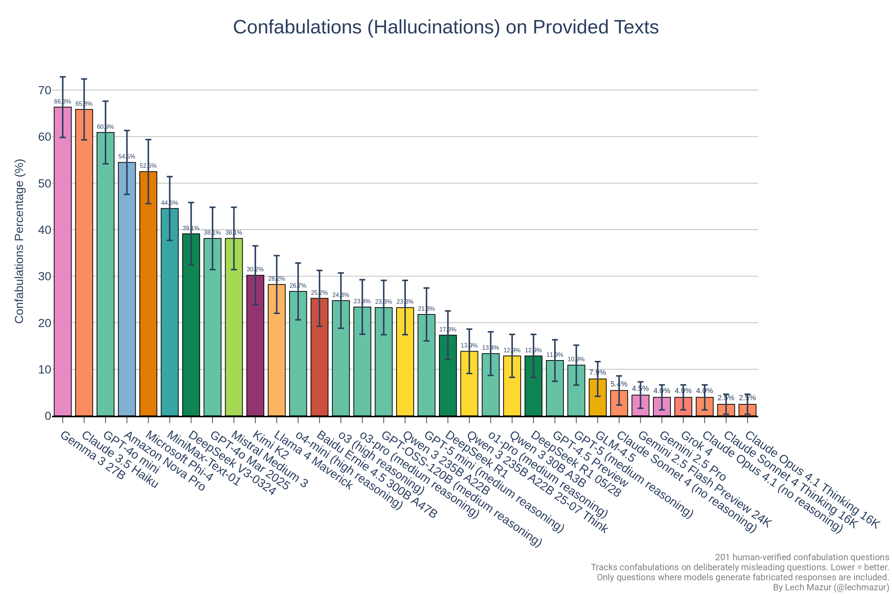
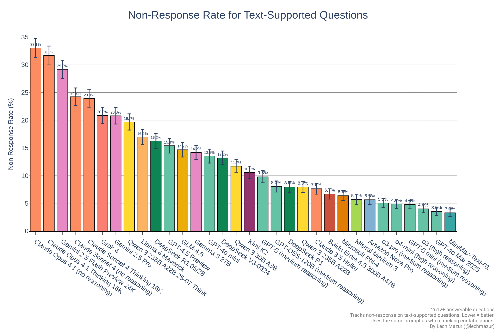

# LLM Confabulation (Hallucination) Leaderboard for RAG

This benchmark evaluates large language models (LLMs) based on how frequently they produce non-existent answers (confabulations or hallucinations) in response to misleading questions that are based on provided text documents. These documents are recent articles not yet included in the LLM training data. Minimizing these types of confabulation is crucial when using Retrieval-Augmented Generation (RAG). The questions are intentionally crafted to be challenging.

As of Feb 10, 2025, 201 questions, confirmed by a human to lack answers in the provided texts, have been carefully curated and assessed. The number of questions will ideally increase over time, and the error margins will continue to narrow. However, the current dataset is already sufficient to differentiate between various models.

---
## Combined Evaluation
Combining confabulation and non-response rates enables a comprehensive ranking. Depending on your priorities, you may prefer [fewer confabulations or fewer non-responses](https://lechmazur.github.io/leaderboard1.html). 

### 50-50 Ranking bar chart

### 50-50 Ranking leaderboard

|Rank|Model|Confab %|Non-Resp %|Weighted|
|---:|---|---:|---:|---:|
|1|Gemini 2.5 Pro Preview 05-06|5.9|15.3|10.62|
|2|Grok 3 Mini Beta (high)|6.9|14.7|10.80|
|3|Gemini 2.5 Pro Exp 03-25|4.0|17.6|10.80|
|4|o1 (medium reasoning)|10.9|12.6|11.74|
|5|Qwen 3 30B A3B|12.9|11.7|12.28|
|6|Gemini 2.5 Pro|4.0|20.8|12.38|
|7|Grok 4|4.0|20.9|12.41|
|8|Gemini 2.0 Flash Think Exp 01-21|14.9|10.0|12.43|
|9|DeepSeek R1|17.3|8.0|12.65|
|10|o1-preview|18.3|7.8|13.04|
|11|Claude Sonnet 4 Thinking 16K|2.5|23.9|13.20|
|12|Gemini 1.5 Pro (Sept)|16.8|10.2|13.54|
|13|GPT-4.5 Preview|11.9|15.4|13.64|
|14|Grok 3 Mini Beta (low)|10.9|17.2|14.04|
|15|Grok 3 Beta (no reasoning)|17.8|10.6|14.19|
|16|o3-pro (medium reasoning)|23.4|5.1|14.22|
|17|o3 (high reasoning)|24.8|4.0|14.38|
|18|DeepSeek R1 05/28|12.9|16.2|14.56|
|19|Claude 3.7 Sonnet Thinking 16K|7.9|21.5|14.71|
|20|Claude Sonnet 4 (no reasoning)|5.4|24.2|14.85|
|21|GPT-4o 2024-08-06|22.3|8.4|15.34|
|22|Qwen QwQ-32B 16K|25.2|5.9|15.57|
|23|Qwen 3 235B A22B|23.3|8.0|15.61|
|24|o4-mini (high reasoning)|26.7|4.8|15.79|
|25|Claude Opus 4 Thinking 16K|2.5|29.4|15.92|
|26|GPT-4o Feb 2025|26.7|6.5|16.63|
|27|Gemini 2.5 Flash Preview 24K|4.5|29.2|16.81|
|28|Claude Opus 4 (no reasoning)|3.0|31.2|17.06|
|29|GPT-4o 2024-11-20|26.2|8.2|17.21|
|30|Llama 3.1 405B|14.4|20.9|17.62|
|31|o3-mini (medium reasoning)|27.2|8.6|17.91|
|32|Gemini 2.0 Pro Exp 02-05|15.8|21.0|18.43|
|33|o3-mini (high reasoning)|30.7|6.2|18.43|
|34|o1-mini|26.2|10.9|18.55|
|35|Qwen 2.5 72B|32.2|6.0|19.09|
|36|Claude 3.7 Sonnet|25.2|14.3|19.76|
|37|Claude 3.5 Sonnet 2024-10-22|12.9|27.0|19.94|
|38|Grok 2 12-12|25.7|14.5|20.14|
|39|GPT-4o Mar 2025|38.1|3.5|20.81|
|40|Mistral Large 2|32.2|10.6|21.40|
|41|Qwen 2.5 Max|31.2|12.4|21.78|
|42|Mistral Medium 3|38.1|5.7|21.90|
|43|Llama 4 Maverick|28.2|16.9|22.58|
|44|Claude 3 Opus|28.2|17.2|22.70|
|45|Llama 3.3 70B|17.8|27.8|22.81|
|46|MiniMax-Text-01|44.6|3.3|23.92|
|47|Mistral Small 3|38.6|11.8|25.21|
|48|DeepSeek V3-0324|39.1|13.2|26.15|
|49|Gemini 2.0 Flash|24.3|29.4|26.85|
|50|Gemma 2 27B|47.3|7.2|27.24|
|51|GPT-4 Turbo|26.7|30.1|28.42|
|52|Microsoft Phi-4|52.5|6.4|29.43|
|53|Amazon Nova Pro|54.5|5.6|30.05|
|54|Claude 3 Haiku|56.9|11.5|34.21|
|55|Claude 3.5 Haiku|65.8|7.6|36.74|
|56|GPT-4o mini|60.9|13.5|37.21|
|57|Gemma 3 27B|66.3|14.2|40.26|

---
## Confabulation and Non-Response Rates

The raw confabulation rate alone isn't sufficient for meaningful evaluation. A model that simply declines to answer most questions would achieve a low confabulation rate. To address this, the benchmark also tracks the LLM non-response rate using the same prompts and documents but specific questions with answers that are present in the text. Currently, 2,612 hard questions (see the prompts) with known answers in the texts are included in this analysis.

Accuracy benchmarks can also be considered for a more comprehensive assessment. This benchmark currently focuses solely on pure confabulations to keep it distinct for now. For example, I have created a separate benchmark to test LLMs using the extended version of the [New York Times Connections](https://github.com/lechmazur/nyt-connections/).

---
## Interesting Hallucination Results
- Claude 3.7 models hallucinate little, but often don't respond with the true answer.
- Reasoning appears to help. For example, DeepSeek R1 performs better than DeepSeek-V3 and Gemini 2.0 Flash Thinking Exp 01-21 performs better than Gemini 2.0 Flash.
- OpenAI o1 confabulates less than DeepSeek R1, but R1 answers questions with known answers more frequently.
- GPT-4o shows a significant improvement over GPT-4 Turbo.
- Gemini 1.5 Pro (September) performs better than Claude models, but there is no improvement with Gemini 2.0 Pro Exp 02-05.
- Gemma 3 27B dissapoints.
- Llama models tend to respond cautiously, resulting in fewer confabulations but higher non-response rates

---
## Additional Notes
- A popular hallucination leaderboard on GitHub uses a model for evaluation of document summaries, but I found this to lead to a very high error rate and different rankings. This approach can be very misleading.
- While the initial set of questions was suggested by LLMs, the final 201 questions were all painstakingly human-verified to have no answers in the provided texts. Only a percentage of LLM-suggested questions were unequivocally answer-free.
- Despite clear prompts, LLMs often generated compound questions that effectively asked for two answers. These were removed in a separate judging step.
- The benchmark includes questions where at least one LLM confabulated, in order to minimize the number of questions requiring human assessment. Because of this, and since the questions are intentionally adversarial, the absolute percentage should not be used to infer that LLMs frequently confabulate. This leaderboard does not reflect a "typical" hallucination rate.
- In some cases, LLMs failed to provide valid responses to the questions, such as skipping certain questions altogether. This occurred only once for the human-selected questions without valid answers in the text (bad Gemma, bad), but happened more frequently for questions with valid answers. These questions were discarded.
- A temperature setting of 0 was used
- Multi-turn ensemble is my unpublished system. It utilizes multiple LLMs (that existed in Oct 2024), multi-turn dialogues, and other proprietary techniques. It is slower and more costly to run but it does very well. It [outperforms](https://x.com/LechMazur/status/1828804485033992514/photo/1) non-o1 LLMs on MMLU-Pro and GPQA.

---
## Other multi-agent benchmarks
- [Public Goods Game (PGG) Benchmark: Contribute & Punish](https://github.com/lechmazur/pgg_bench/)
- [Elimination Game: Social Reasoning and Deception in Multi-Agent LLMs](https://github.com/lechmazur/elimination_game/)
- [Step Race: Collaboration vs. Misdirection Under Pressure](https://github.com/lechmazur/step_game/)

## Other benchmarks
- [Extended NYT Connections](https://github.com/lechmazur/nyt-connections/)
- [LLM Thematic Generalization Benchmark](https://github.com/lechmazur/generalization/)
- [LLM Creative Story-Writing Benchmark](https://github.com/lechmazur/writing/)
- [LLM Confabulation/Hallucination Benchmark](https://github.com/lechmazur/confabulations/)
- [LLM Deceptiveness and Gullibility](https://github.com/lechmazur/deception/)
- [LLM Divergent Thinking Creativity Benchmark](https://github.com/lechmazur/divergent/)

---
## Updates 
- July 10, 2025: Grok 4 added.
- June 11, 2025: o3-pro added.
- June 6, 2025: Gemini 2.5 Pro Preview 06-06 added.
- May 29, 2025: DeepSeek R1 05/28 added.
- May 23, 2025: Claude 4 added.
- May 8, 2025: Gemini 2.5 Pro Preview 05-06, Mistral Medium 3 added.
- April 30, 2025: Qwen 3 added.
- April 18, 2025: o3, o4-mini, Gemini 2.5 Flash added.
- April 12, 2025: Grok 3 added.
- April 7, 2025: Llama 4 Maverick added.
- March 27, 2025: GPT-4o March 2025 added.
- March 26, 2025: Gemini 2.5 Pro Exp 03-25, DeepSeek V3-0324, o3-mini-high added.
- March 13, 2025: Gemma 3 27B added.
- March 7, 2025: Qwen QwQ-32B added.
- Feb 27, 2025: GPT-4.5 Preview added.
- Feb 26, 2025: Claude 3.7 Sonnet, Claude 3.7 Sonnet Thinking, GPT-4o Feb 2025 added.
- Feb 10, 2025: 17 human-verified questions based on Jan 2025-Feb 2025 articles added. 176 answerable questions added.
- Feb 7, 2025: DeepSeek R1, o1, o3-mini (medium reasoning effort), DeepSeek-V3, Gemini 2.0 Flash Thinking Exp 01-21, Qwen 2.5 Max, Microsoft Phi-4, Amazon Nova Pro, Mistral Small 3, MiniMax-Text-01 added.
- Nov. 5, 2024: Claude 3.5 Haiku added
- Oct. 23, 2024: Grok Beta added
- Oct. 23, 2024: Claude 3.5 Sonnet (2024-10-22) added
- Oct. 15, 2024: Grok 2 added
- Follow [@lechmazur](https://x.com/LechMazur) on X (Twitter) for other upcoming benchmarks and more.

